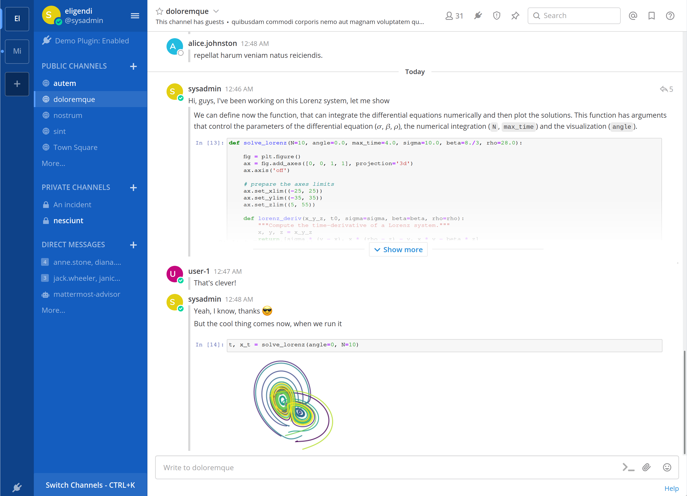

# Jupyter Integration Proposal

My submission for this hackathon is a technical design document for a new plugin: https://docs.google.com/document/d/1aDHOPnJng3NXgRlAOh6_SzTE2tK4dWXrWi3sFaDLq2w/edit#

The idea is simple: integrate Jupyter notebooks into Mattermost, converting the threads into notebook-like entities that can render both normal posts and interactive code cells.

