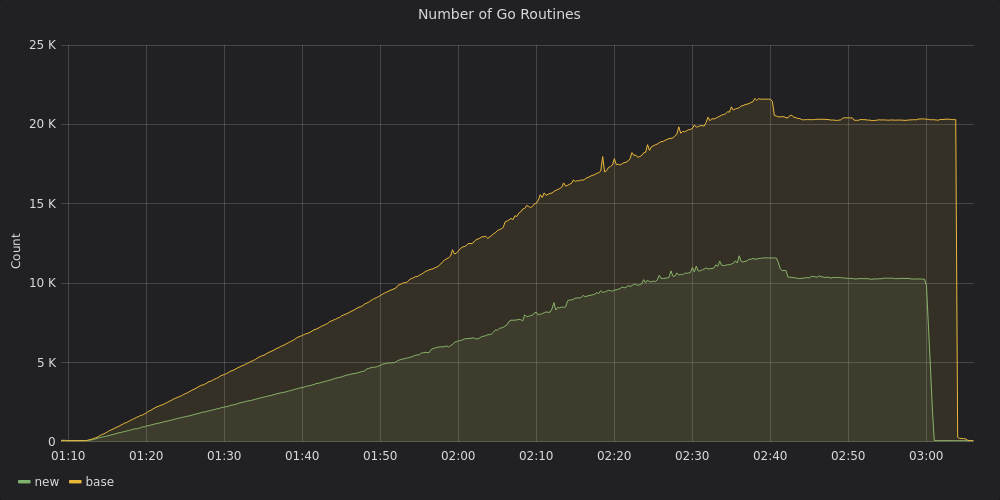
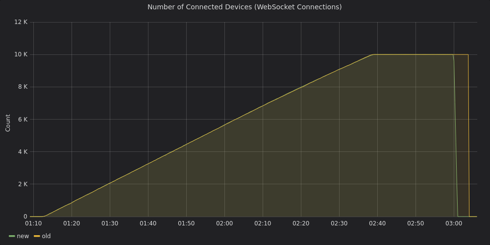
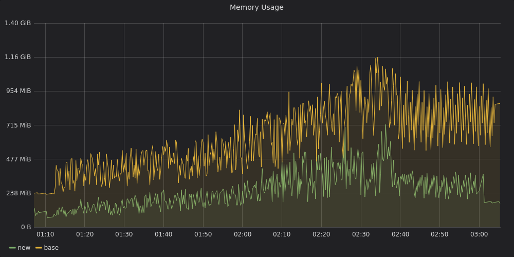

### Scaling WebSocket Connections

A rewrite of the websocket architecture to allow it to scale to a large number of connnections.

The below Grafana graphs show the memory improvements of an idle server handling 10k connections. We see an improvement in memory usage as well
as the number of goroutines reduce by half.

